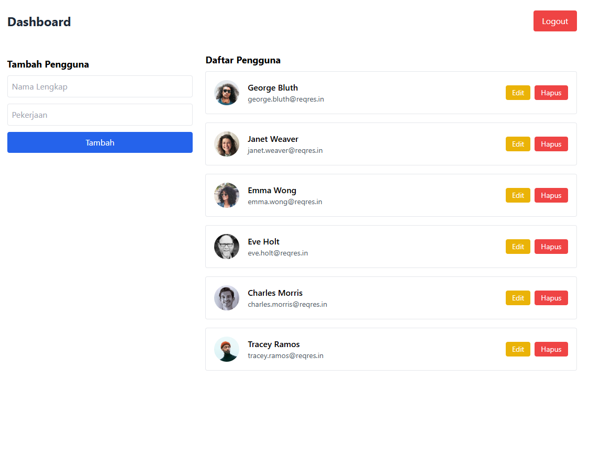
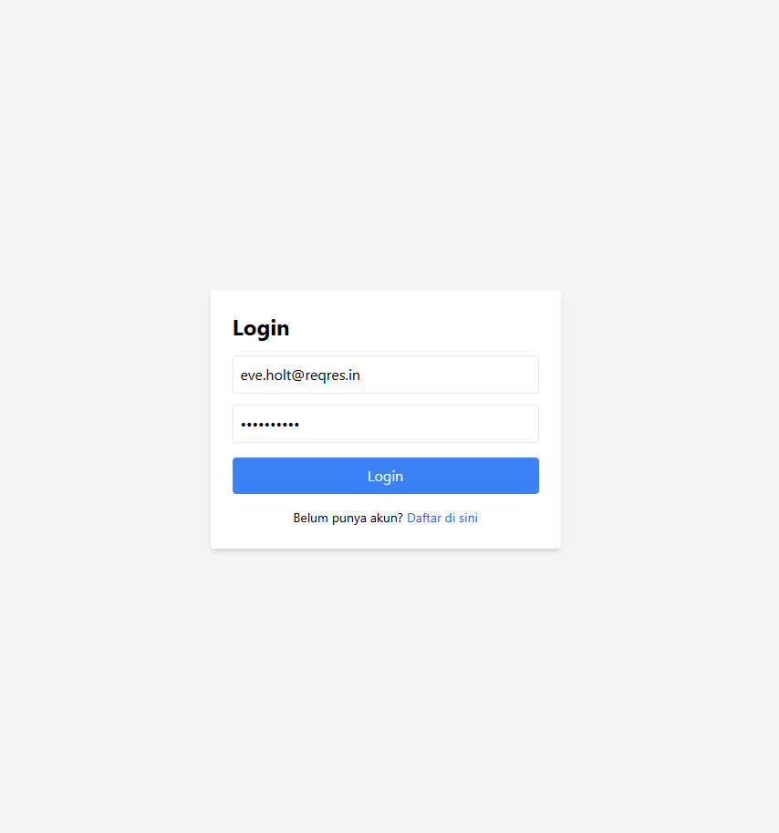
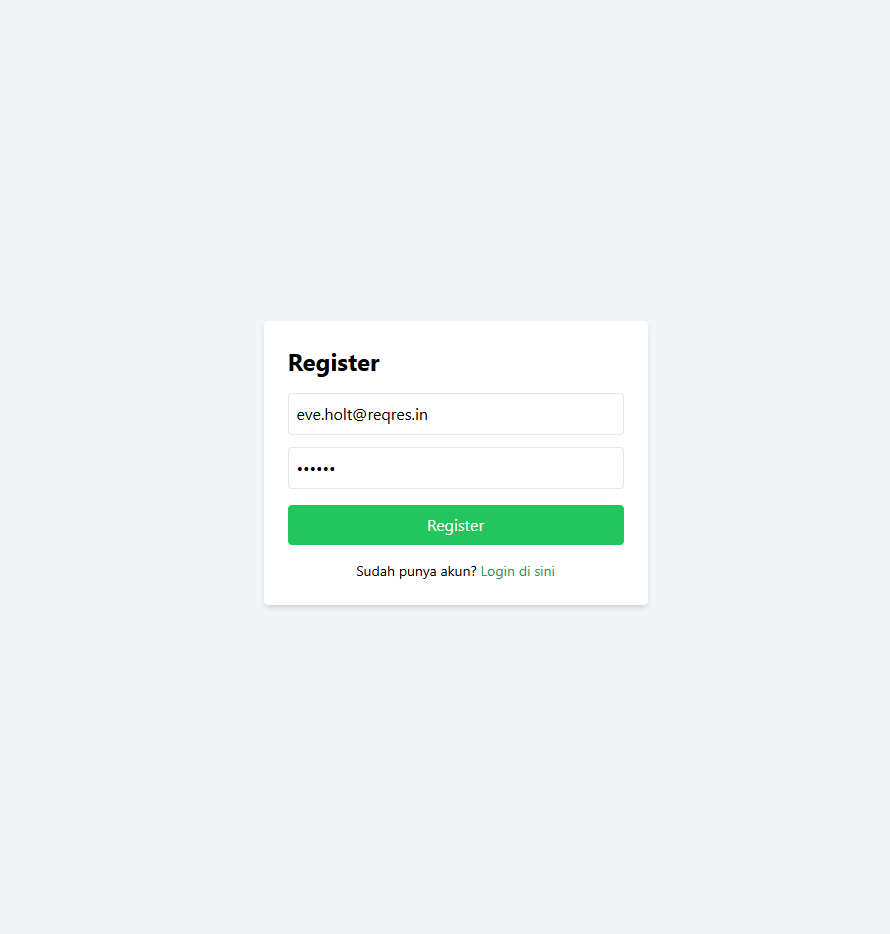

# CRUD Reqres

Proyek ini adalah aplikasi sederhana berbasis React untuk melakukan operasi **CRUD (Create, Read, Update, Delete)** terhadap data user menggunakan **[Reqres API](https://reqres.in/)**. Aplikasi ini dibuat untuk keperluan technical test Frontend Developer Internship di Talenavi.

## 👨‍💻 Nama Kandidat
**Alvin Zacky Atttalie**

## 🚀 Tech Stack
- **React 19**
- **React Router DOM v7**
- **Tailwind CSS v3**
- **Axios**
- **React Toastify**

## 📂 Fitur Aplikasi
- Menampilkan daftar user dari Reqres API
- Menambahkan user baru
- Mengedit data user
- Menghapus user
- Notifikasi sukses/gagal menggunakan `react-toastify`
- Responsive dan clean UI dengan Tailwind CSS

## 🕒 Durasi Pengerjaan
± 1 jam 30 menit.

## 🔗 Link
- **Repository GitHub:** [https://github.com/AlvinAttalie-id/frontend-learning]
- **Video Presentasi Loom:** [https://www.loom.com/share/5e4777b1b1e145a4a7b7894375664890?sid=b5f1e0a4-673b-406a-ae4b-73e478ef8941z]

## 📸 Screenshot




## 📦 Instalasi dan Menjalankan Proyek
```bash
git clone https://github.com/AlvinAttalie-id/frontend-learning.git
cd crud-reqres
npm install
npm start
